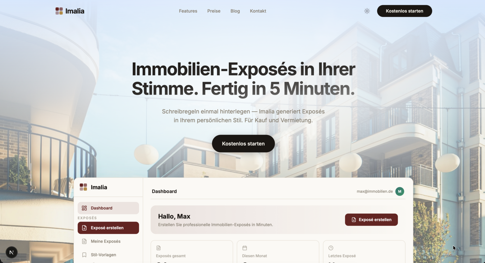
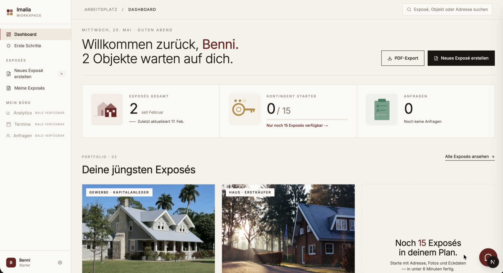

# Imalia

> [!NOTE]
> **Showcase / Portfolio.** Dieses Repo präsentiert das Imalia-Projekt als Fallstudie. Der Produktions-Code liegt in einem privaten Monorepo — die weiter unten genannten Architektur-, Setup- und Build-Angaben beziehen sich auf dieses Quellprojekt und sind hier nicht klon- oder lauffähig.

**Marketing-Site — imalia.de**



**SaaS-App — app.imalia.de**




KI-gestützte Exposé-Generierung für Immobilienmakler. Turborepo-Monorepo mit zwei Next.js-Apps.

## Was ist Imalia?

Imalia ist ein SaaS-Tool, das Immobilienmaklern hilft, Verkaufstexte für ihre Objekte schneller und in besserer Qualität zu erstellen. Statt für jedes Objekt manuell Portal-Beschreibung, Website-Text und Social-Media-Post zu schreiben, gibt der Makler einmal die Objektdaten ein und erhält fertige Texte für mehrere Kanäle gleichzeitig — in seiner eigenen Schreibstimme und auf eine konkrete Käufer-Zielgruppe zugeschnitten.

**Das Problem:** Generische KI-Tools liefern austauschbare Texte ohne persönliche Handschrift, ohne Zielgruppen-Fokus und ohne portalgerechte Struktur. Manuelles Schreiben kostet pro Objekt 30–60 Minuten.

**Der Ansatz:** Ein Generator, der speziell auf Makler-Workflows zugeschnitten ist — mit sieben Käufer-Personas, drei Tonalitäten, hinterlegten Schreibregeln, automatischer Standort- und Marktdaten-Anreicherung und Export-Formaten für gängige Portale und CRMs.

## Wie es funktioniert (User-Flow)

1. **Objektdaten eingeben** — Adresse, Fläche, Zimmer, Ausstattung, Modernisierungen, Energieausweis-Daten. Pflichtfelder folgen GEG- und Portal-Anforderungen.
2. **Persona & Tonalität wählen** — z. B. „Junge Familie / emotional" oder „Kapitalanleger / sachlich". Die Persona steuert Fokus (Schulen vs. Rendite), Wortwahl und Standortradius.
3. **Anreicherung im Hintergrund** — Geocoding, Mikrolage (POIs im persona-spezifischen Radius), Makrolage (Stadtteil, Anbindung), optional BORIS-Bodenrichtwert und Kaufnebenkosten/AfA-Rechner.
4. **Varianten-Generierung** — Claude erzeugt mehrere Textvarianten ohne Usage-Abrechnung. Der Nutzer wählt eine aus.
5. **Multi-Channel-Output** — Aus der gewählten Variante werden Portal-Text, Website-Text und Social-Media-Posts abgeleitet. Erst hier zählt das Exposé gegen das Monatskontingent.
6. **Export & Verteilung** — PDF, Word, OpenImmo-XML für Portal-Upload, oder direkter Push an CRMs (Propstack, onOffice, FLOWFACT).

## Wichtigste Features

- **7 Käufer-Personas** mit gestaffeltem Plan-Gating (Basic: 2, Standard: 4, Pro: alle 7)
- **3 Tonalitäten** — sachlich, emotional, storytelling
- **Persönliche Schreibregeln** — Anrede, verbotene Floskeln, Textaufbau einmal definieren, bei jeder Generierung berücksichtigt
- **Standortanalyse** — Mikrolage (Nominatim + Overpass/OSM-POIs) und Makrolage (Stadtteil, regionale Anbindung)
- **Marktdaten** — BORIS-D Bodenrichtwerte (14 Bundesländer, 5 Provider)
- **Lagekarte** auf OpenStreetMap-Basis
- **Rechner** — AfA für Kapitalanleger, Kaufnebenkosten
- **Multi-Portal-Export** — PDF, Word, OpenImmo-XML, direkte CRM-Anbindung
- **Team-Funktion** — geteiltes Usage-Kontingent (Pro-Plan)
- **KI-Chatbot & Copilot** für Fragen und nachträgliche Text-Bearbeitung
- **DSGVO-konform** — EU-Hosting (Hetzner Frankfurt), AVV mit LLM-Anbieter, Auftragsverarbeitung dokumentiert
- **EU-Compliance** — AI-Act-Transparenzpflichten, Art. 4 KI-Kompetenz-Nachweis, CRA-Vorbereitung

## Technische Architektur

Zwei separate Next.js-Apps in einem Turborepo-Monorepo, getrennt deploybar, mit geteilten Packages:

- **`apps/web` (imalia.de)** — öffentliche Marketing-Site: Homepage, Pricing, Blog, FAQ, rechtliche Seiten. Statisch optimiert, SEO-fokussiert.
- **`apps/app` (app.imalia.de)** — authentifizierte SaaS-App: Dashboard, Exposé-Generator, Settings, Team, Kalender, CRM-Integrationen. Server Components laden Daten, Client Components für Interaktion.
- **`packages/config`** — Single Source of Truth für Plan-Definitionen, Feature-Gates, Pricing.
- **`packages/legal`** — geteilte Rechtstexte (Datenschutz, AGB, Impressum), die in beiden Apps identisch erscheinen.
- **`packages/tailwind-config`** — gemeinsames Design-System (Teal-Palette, Inter, Tailwind v4 via `@theme`).

**Datenfluss bei Exposé-Generierung:**

```
User-Input → Validierung (Zod) → Anreicherung (Geocoding, POIs, Marktdaten)
          → Prompt-Building (Persona + Tonalität + Schreibregeln + Knowledge)
          → LLM (Claude direkt oder via AWS Bedrock)
          → Parser & Quality-Check → Varianten-Auswahl
          → Channel-Ableitung (Portal/Web/Social) → Speicherung (Supabase)
          → Export (PDF/Word/OpenImmo/CRM-Push)
```

**Backend-Bausteine:** Supabase (Auth, Postgres, Storage, Rate-Limiting via Tabellen), Stripe (Subscriptions, Webhooks), Resend (Transactional Mails), Anthropic Claude oder AWS Bedrock als LLM-Provider (konfigurierbar via `LLM_PROVIDER`).

**Sicherheit:** `sanitizeForPrompt()` für alle Freitext-Felder (Prompt-Injection-Schutz), Bearer-Token + Cookie-Auth via `createApiClient()`, Plan-Gating zentral in `src/lib/stripe/config.ts`.

## Apps & Packages

| App/Package | Beschreibung | Domain |
|-------------|-------------|--------|
| `apps/app` | SaaS-Anwendung (Dashboard, Exposés, Chat, API) | app.imalia.de |
| `apps/web` | Marketing-Website (Homepage, Blog, Landing Pages) | imalia.de |
| `packages/config` | Shared Plan-Config, Feature-Gates, Types | — |
| `packages/legal` | Shared Legal-Texte (Datenschutz, AGB, Impressum) | — |
| `packages/tailwind-config` | Shared Tailwind v4 Theme (Teal-Palette, Inter) | — |

## Tech Stack

- **Framework:** Next.js 16+ (App Router), React 19, TypeScript 5.9
- **Monorepo:** Turborepo + pnpm Workspaces
- **Backend:** Supabase (Auth, DB, Storage), Stripe (Billing)
- **Styling:** Tailwind CSS v4 + shadcn/ui
- **LLM:** Anthropic Claude (Exposé-Generierung, Chat)
- **Testing:** Vitest (Unit), Playwright (E2E)
- **Hosting:** Hetzner Cloud VPS (DE) + Coolify

## Entwicklung

```bash
# Dependencies installieren
pnpm install

# Alle Apps im Dev-Modus starten
pnpm turbo dev

# Nur die SaaS-App starten
pnpm turbo dev --filter=@imalia/app

# Nur die Marketing-Site starten
pnpm turbo dev --filter=@imalia/web
```

## Qualitätssicherung

```bash
# TypeScript-Check (alle Workspaces)
pnpm turbo typecheck

# Unit Tests (SaaS-App)
pnpm turbo test:run --filter=@imalia/app

# Alles zusammen
pnpm turbo typecheck && pnpm turbo test:run --filter=@imalia/app
```

## Build

```bash
# Beide Apps bauen
pnpm turbo build

# Einzelne App bauen
pnpm turbo build --filter=@imalia/app
pnpm turbo build --filter=@imalia/web
```

## Projektstruktur

```
imalia/
├── apps/
│   ├── app/                    # SaaS-App (app.imalia.de)
│   │   ├── src/
│   │   │   ├── app/            # Next.js App Router
│   │   │   ├── components/     # React Components
│   │   │   ├── lib/            # Business Logic
│   │   │   └── types/          # TypeScript Types
│   │   └── e2e/                # Playwright E2E Tests
│   └── web/                    # Marketing (imalia.de)
│       └── src/
│           ├── app/            # Pages (Homepage, Blog, Legal)
│           └── components/     # Marketing Components
├── packages/
│   ├── config/                 # @imalia/config
│   ├── legal/                  # @imalia/legal
│   └── tailwind-config/        # @imalia/tailwind-config
├── turbo.json
├── pnpm-workspace.yaml
├── Dockerfile.app
└── Dockerfile.web
```
